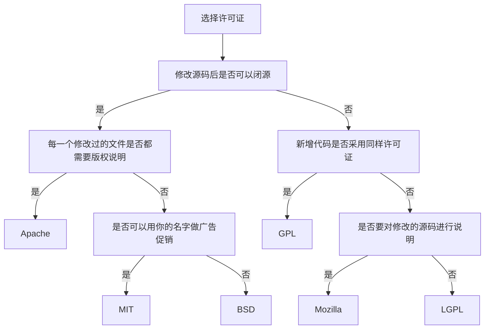

```mermaid
graph TB
    A[选择许可证] -->  B[修改源码后是否可以闭源] --> |是| D[每一个修改过的文件是否都需要版权说明]--> |是| E[Apache]
    B-->|否|F[新增代码是否采用同样许可证] --> |是|G[GPL]
    D-->|否|H[是否可以用你的名字做广告促销] --> |是|I[MIT]
    H-->|否|J[BSD]
    F-->|否|K[是否要对修改的源码进行说明]-->|是|L[Mozilla]
    K-->|否|M[LGPL]
```
简单可以认为：
- 只想好好写代码，其他我不管（MIT）
- 我想保留专利，你们可以随意使用（Apache）
- 我想让我的源码开枝散叶（GPL）
